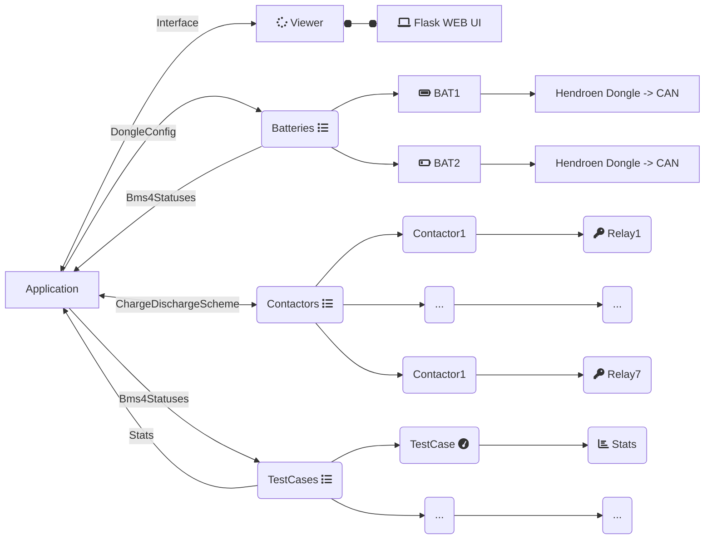

# flask-snippets

Some flask code examples

## Arch

```mermaid
flowchart LR
    App[Application ] <--> |Interface| Viewer[fa:fa-spinner Viewer] o--o Flask[fa:fa-laptop Flask WEB UI]
    App --> |DongleConfig| Batteries(Batteries fa:fa-list) --> |Bms4Statuses| App;
    App <--> |ChargeDischargeScheme| Contactors(Contactors fa:fa-list);
    App --> |Bms4Statuses| Tests(TestCases fa:fa-list) --> |Stats| App;

    Batteries --> BAT1[fa:fa-battery-full BAT1] --> DONGLE1[Hendroen Dongle -> CAN]


    Batteries --> BAT2[fa:fa-battery-2 BAT2] --> DONGLE2[Hendroen Dongle -> CAN]

    Contactors --> KM1(Contactor1)--> R1(fa:fa-key  Relay1)
    Contactors --> KMx(...) --> Rx(...)
    Contactors --> KM7(Contactor1) --> R7(fa:fa-key Relay7)

    Tests --> Test(TestCase fa:fa-tachometer)--> S1(fa:fa-bar-chart Stats)
    Tests --> Testx(...) --> Sx(...)
```

## Links

* [svg.js](https://svgjs.dev/docs/3.1/)
